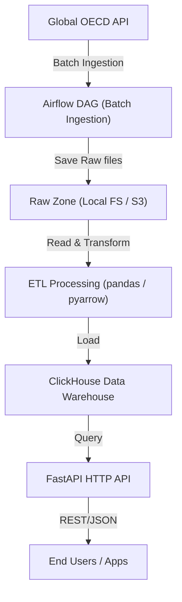

# OpenDataFusion

OpenDataFusion 是一个面向全球公共数据源的自动化数据采集, 清洗, 建模与 API 服务平台. 目标是构建一个可扩展, 可生产部署, 可持续扩展的数据湖 + 数据仓库一体化平台.

---

## 🌎 Milestone 1 (MVP 功能)

- 从 OECD API 自动采集全球经济类公共数据
- 存储至本地对象存储(Raw Zone)
- 清洗后转换为 Parquet(Clean Zone)
- 写入 ClickHouse 数据仓库 (Curated Zone)
- 通过 FastAPI 提供数据查询 API
- 全流程由 Airflow DAG 自动调度
- Docker Compose 一键启动全部服务

## 🧱 架构 (MVP)



## Project Structure

```plaintext
OpenDataFusion/
├── README.md
├── docker-compose.yml
├── airflow/
│   ├── dags/
│   │   └── oecd_ingest_dag.py
│   └── requirements.txt
├── ingestion/
│   └── oecd_ingest.py
├── processing/
│   └── clean_oecd.py
├── warehouse/
│   └── create_tables.sql
├── api/
│   ├── main.py
│   └── requirements.txt
├── config/
│   └── settings.py
└── utils/
    ├── http_client.py
    ├── storage.py
    └── logging.py
```